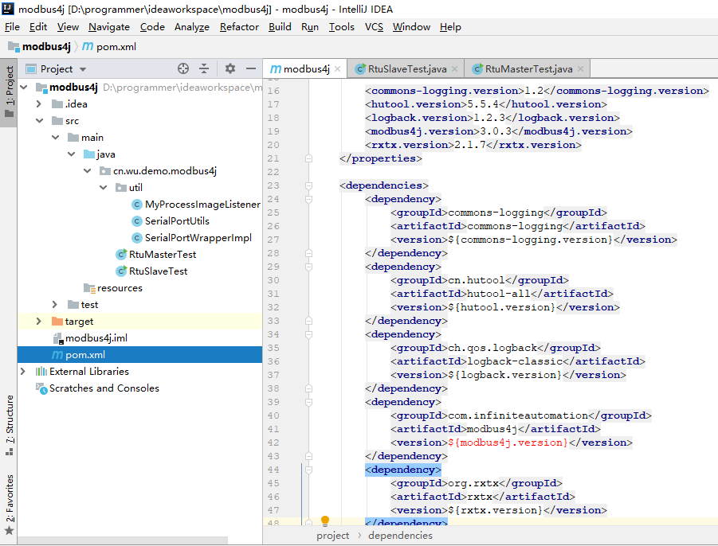
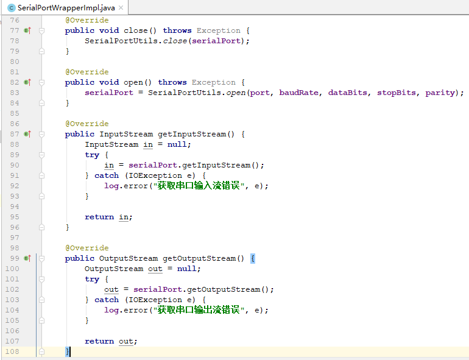
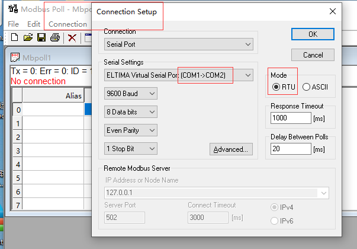
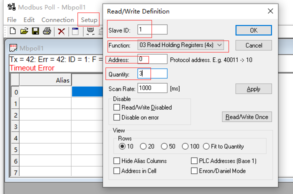
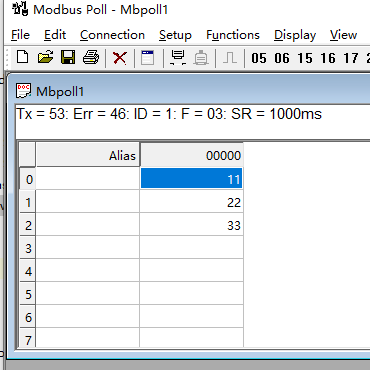

### 使用Modbus4J进行RTU模式串口通信

Modus协议是由MODICON（现为施耐德电气公司的一个品牌）在1979年开发的，是全球第一个真正用于工业现场的总线协议，应用非常广泛，可谓大名鼎鼎。

理论性的东西就不多介绍了，推荐一本书《Modbus软件开发实战指南》，杨更更著，写得非常好，从理论到实战，手把手教你玩转Modbus，不过代码实战部分使用的是C#，笔者没练过这项武功，还是看一下Java中怎么应用吧，网上资料多用Modbus4J，就选它了。

Modbus4J源代码：https://github.com/infiniteautomation/modbus4j

Modbus4J没有提供底层串口驱动，因此需要先掌握一些Java串口编程的能力，快速入门可以参考笔者之前写的《[Java串口编程例子](https://www.cnblogs.com/bgcx/p/14220915.html)》这篇文章，本文就是在此基础上进行的，也应用了其中的串口编程工具类代码。

#### 创建项目

新建modbus4j项目，如下图所示：



源代码地址：https://github.com/wu-boy/modbus4j.git

#### 测试步骤

##### 实现底层串口驱动

Modbus4J没有提供底层串口驱动，因此使用串口工具类SerialPortUtils来打开和关闭串口，代码如下：

```java
public class SerialPortUtils {

    private static Logger log = LoggerFactory.getLogger(SerialPortUtils.class);

    /**
     * 打卡串口
     * @param portName 串口名
     * @param baudRate 波特率
     * @param dataBits 数据位
     * @param stopBits 停止位
     * @param parity 校验位
     * @return 串口对象
     */
    public static SerialPort open(String portName, Integer baudRate, Integer dataBits,
                                  Integer stopBits, Integer parity) {
        SerialPort result = null;
        try {
            // 通过端口名识别端口
            CommPortIdentifier identifier = CommPortIdentifier.getPortIdentifier(portName);
            // 打开端口，并给端口名字和一个timeout（打开操作的超时时间）
            CommPort commPort = identifier.open(portName, 2000);
            // 判断是不是串口
            if (commPort instanceof SerialPort) {
                result = (SerialPort) commPort;
                // 设置一下串口的波特率等参数
                result.setSerialPortParams(baudRate, dataBits, stopBits, parity);
                log.info("打开串口{}成功", portName);
            }else{
                log.info("{}不是串口", portName);
            }
        } catch (Exception e) {
            log.error("打开串口{}错误", portName, e);
        }
        return result;
    }

    /**
     * 关闭串口
     * @param serialPort
     */
    public static void close(SerialPort serialPort) {
        if (serialPort != null) {
            serialPort.close();
            log.warn("串口{}关闭", serialPort.getName());
        }
    }

}
```

#### 实现Modbus4J串口包装器接口

Modbus4J提供了串口包装器接口，但是没有提供实现，因此自己新建一个实现类SerialPortWrapperImpl，作用是为Modbus4J提供串口对象SerialPort和操作串口的方法，例如打开/关闭串口，获取串口输入/输出流等，核心代码如下：



## 模拟从站设备

RtuSlaveTest类模拟了一个地址为1的从站设备，使用串口“COM2“（请提前使用虚拟串口软件Virtual Serial Port Driver模拟出来COM1和COM2串口），通过ModbusFactory创建RtuSlave，然后模拟线圈状态、离散输入状态、保持寄存器和输入寄存器的数据，代码中有详细注释，代码如下：

```java
public class RtuSlaveTest {

    public static void main(String[] args) {
        createRtuSlave();
    }

    public static void createRtuSlave(){
        // 设置串口参数，串口是COM2，波特率是9600
        SerialPortWrapperImpl wrapper = new SerialPortWrapperImpl("COM2", 9600,
                SerialPort.DATABITS_8, SerialPort.STOPBITS_1, SerialPort.PARITY_NONE, 0, 0);

        // Modbus工厂，可以创建RTU、TCP等不同类型的Master和Slave
        ModbusFactory modbusFactory = new ModbusFactory();

        final ModbusSlaveSet slave = modbusFactory.createRtuSlave(wrapper);

        // 这玩意网上有人叫做过程影像区，其实就是寄存器
        // 寄存器里可以设置线圈状态、离散输入状态、保持寄存器和输入寄存器
        // 这里设置了从站设备ID是1
        BasicProcessImage processImage = new BasicProcessImage(1);
        processImage.setInvalidAddressValue(Short.MIN_VALUE);
        slave.addProcessImage(processImage);

        // 添加监听器，监听slave线圈状态和保持寄存器的写入
        processImage.addListener(new MyProcessImageListener());

        setCoil(processImage);
        setInput(processImage);
        setHoldingRegister(processImage);
        setInputRegister(processImage);

        // 开启线程启动从站设备
        new Thread(() -> {
            try {
                slave.start();
            }
            catch (ModbusInitException e) {
                e.printStackTrace();
            }
        }).start();

        /*new Timer().schedule(new TimerTask() {
            @Override
            public void run() {
                // 间隔1秒修改从站设备1的保持寄存器数据
                updateHoldingRegister(slave.getProcessImage(1));
            }
        }, 1000, 1000);*/
    }

    private static void setCoil(ProcessImage processImage){
        // 模拟线圈状态
        processImage.setCoil(0, true);
        processImage.setCoil(1, false);
        processImage.setCoil(2, true);
    }

    private static void setInput(ProcessImage processImage){
        // 模拟离散输入状态
        processImage.setInput(0, false);
        processImage.setInput(1, true);
        processImage.setInput(2, false);
    }

    private static void setHoldingRegister(ProcessImage processImage){
        // 模拟保持寄存器的值
        processImage.setHoldingRegister(0,(short) 11);
        processImage.setHoldingRegister(1,(short) 22);
        processImage.setHoldingRegister(2,(short) 33);
    }

    private static void updateHoldingRegister(ProcessImage processImage){
        // 模拟修改保持寄存器的值
        processImage.setHoldingRegister(0, (short) RandomUtil.randomInt(0, 100));
        processImage.setHoldingRegister(1,(short) RandomUtil.randomInt(0, 100));
        processImage.setHoldingRegister(2,(short) RandomUtil.randomInt(0, 100));
    }

    private static void setInputRegister(ProcessImage processImage){
        // 模拟输入寄存器的值
        processImage.setInputRegister(0,(short) 44);
        processImage.setInputRegister(1,(short) 55);
        processImage.setInputRegister(2,(short) 66);
    }
}
```

####### 使用Modbus Poll测试模拟的从站设备

Modbus Poll和Modbus Slave分别是主站设备仿真工具和从站设备仿真工具，是Modbus开发最常用的两个测试软件，下载地址：https://www.modbustools.com/

网上最近出现了一个国产软件Mthings，能够同时支持模拟主从机功能，据说功能强大还有使用手册，免安装免费使用！笔者由于参考了《Modbus软件开发实战指南》这本书，就没使用Mthings，有兴趣的同学可以试用。

1. 设置连接参数

下载安装后，打开连接参数进行设置，如下图所示：



RtuSlaveTest类使用了串口COM2来模拟从站设备，因此这里选择COM1，选择RTU模式，点击OK。

1. 定义读写规则

选择菜单【Setup】->【Read/Write Definition…】，如下图所示：



设置从站设备地址为1，功能码03是读取保持寄存器数据，寄存器地址为0，数量为3，因为RtuSlaveTest程序中模拟了3个数据，点击OK，如下图所示：



可以看到读取到了RtuSlaveTest程序中模拟的3个寄存器的数据，注意别忘了先启动RtuSlaveTest程序！

选择不同的功能码就可以读取不同的数据，01读取线圈状态，02读取离散输入状态，03读取保持寄存器，04读取输入寄存器。

###### 模拟主站设备

实际开发中可能更多的是开发主站设备程序，RtuMasterTest代码如下：

```java
public class RtuMasterTest {

    public static void main(String[] args) throws Exception{
        createRtuMaster();
    }

    private static void createRtuMaster() throws Exception{
        // 设置串口参数，串口是COM1，波特率是9600
        SerialPortWrapperImpl wrapper = new SerialPortWrapperImpl("COM1", 9600,
                SerialPort.DATABITS_8, SerialPort.STOPBITS_1, SerialPort.PARITY_NONE, 0, 0);
        ModbusFactory modbusFactory = new ModbusFactory();
        ModbusMaster master = modbusFactory.createRtuMaster(wrapper);
        master.init();

        // 从站设备ID是1
        int slaveId = 1;

        // 读取保持寄存器
        readHoldingRegisters(master, slaveId, 0, 3);
        // 将地址为0的保持寄存器数据修改为0
        writeRegister(master, slaveId, 0, 0);
        // 再读取保持寄存器
        readHoldingRegisters(master, slaveId, 0, 3);
    }

    private static void readHoldingRegisters(ModbusMaster master, int slaveId, int start, int len) throws Exception{
        ReadHoldingRegistersRequest request = new ReadHoldingRegistersRequest(slaveId, start, len);
        ReadHoldingRegistersResponse response = (ReadHoldingRegistersResponse) master.send(request);
        if (response.isException()){
            System.out.println("读取保持寄存器错误，错误信息是" + response.getExceptionMessage());
        }else {
            System.out.println("读取保持寄存器=" + Arrays.toString(response.getShortData()));
        }
    }

    private static void writeRegister(ModbusMaster master, int slaveId, int offset, int value) throws Exception{
        WriteRegisterRequest request = new WriteRegisterRequest(slaveId, offset, value);
        WriteRegisterResponse response = (WriteRegisterResponse) master.send(request);
        if (response.isException()){
            System.out.println("写保持寄存器错误，错误信息是" + response.getExceptionMessage());
        }else{
            System.out.println("写保持寄存器成功");
        }
    }
}
```

先启动RtuSlaveTest从站设备模拟程序，再启动RtuMasterTest主站设备模拟程序，可以看到双方控制台均有预期输出，RtuMasterTest能够读写RtuSlaveTest中的数据。

##### 参考资料

1、[初探ModBus4j简单使用指南](https://blog.csdn.net/weixin_40774605/article/details/102585399)
2、[使用java的modbus4j的Rtu方式获取监测数据](https://blog.csdn.net/yhj_911/article/details/107179440)
3、[Modbus java slave app](https://www.cnblogs.com/leohe/p/7285313.html)