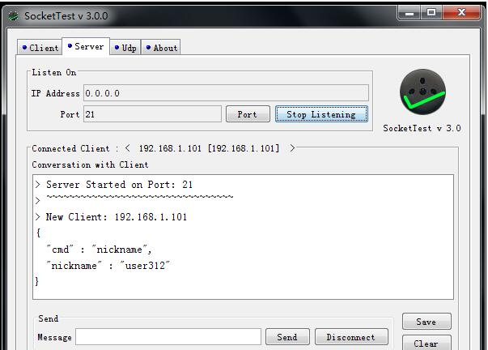
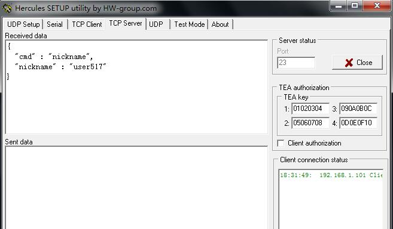

### Socket测试工具（客户端、服务端）

***Socket是什么？***

SOCKET用于在两个基于TCP/IP协议的应用程序之间相互通信。最早出现在UNIX系统中，是UNIX系统主要的信息传递方式。在WINDOWS系统中，SOCKET称为WINSOCK。**实际上socket是对TCP/IP协议的封装，Socket本身并不是协议，而是一个调用接口(API)。通过Socket，我们才能使用TCP/IP协议。**实际上，Socket跟TCP/IP协议没有必然的联系。**Socket编程接口在设计的时候，就希望也能适应其他的网络协议**。所以说，Socket的出现只是使得程序员更方便地使用TCP/IP协议栈而已，是对TCP/IP协议的抽象，从而形成了我们知道的一些最基本的函数接口，比如create、listen、connect、accept、send、read和write等等。网络有一段关于socket和TCP/IP协议关系的说法比较容易理解：**TCP/IP只是一个协议栈**，就像操作系统的运行机制一样，必须要具体实现，同时还要提供对外的操作接口。这个就像操作系统会提供标准的编程接口，比如win32编程接口一样，**TCP/IP也要提供可供程序员做网络开发所用的接口，这就是Socket编程接口。**
**首先要知道的:socket传输 分为输入流也叫写入流(`针对于客户端而言的,来源于服务器端`),输出流(`从客户端输出,发送至服务器端`)。**

**1、SocketTest**

**简介**

一个 java 写的 socket 测试工具。它可以创建 TCP 和 UDP 客户端或服务器。它可以用来测试的任何使用 TCP 或 UDP 协议进行通信的服务器或客户端。由于是 java 写的所以可以跨平台使用。注意：如果是在 MacOS 下使用，开启的监听端口要大于 1024。否则会报 Permission denied 错误。

**下载**

下载地址：http://sockettest.sourceforge.net/

**2、sokit**

**简介**

sokit 是一个在 windows 平台下免费的 TCP/UDP 测试（调试）工具，免安装，可以用来接收，发送或转发 TCP/UDP 数据包。
它有三种工作模式： 服务器模式、客户端模式、转发器模式。
支持发送 ascii 字符串数据，以及十六进制表示的原始字节，单次发送的字符数目没有限制；收到的数据会同时以这两种形式显示。

GitHub：https://github.com/sinpolib/sokit

**下载**

下载地址：http://sokit.soft32.com/
度盘：https://pan.baidu.com/s/1f_HIo8WsBmVVBJrAAvfKAw 提取码：c1ry

**3、Hercules SETUP utility**

**简介**

同样是一个 windows 平台下的 socket 测试工具。工具包括了串口终端（RS-485 或 RS-232 终端），UDP/IP 终端，TCP/IP 客户或服务器终端。

**下载**

下载地址：http://www.hw-group.com/products/hercules/index_en.html

